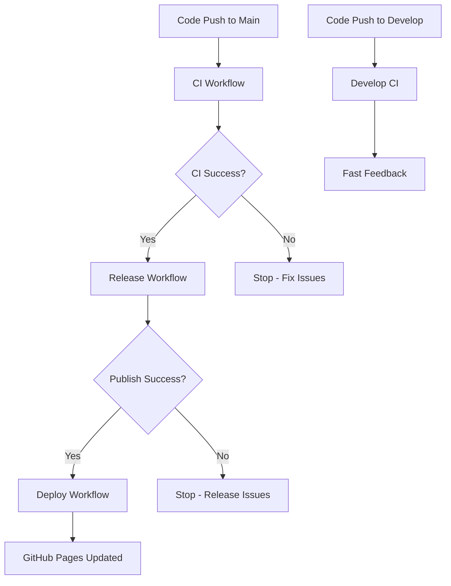

# CI Workflow Optimization

## Overview

This document outlines the optimization of our GitHub Actions CI/CD workflows to reduce redundancy and improve efficiency.

## Problem Analysis

### Before Optimization
- **5 separate workflows** triggered on the same code changes
- **10 total CI jobs** (5 workflows × 2 Node versions) for a single release
- **4 redundant builds** of the same code with identical steps
- **Wasted compute resources** and slower feedback loops

### Workflow Redundancy Issues
1. `main-branch.yml` - Full CI + Release logic
2. `develop-ci.yml` - Full CI for develop branch  
3. `deploy-examples.yml` - Rebuilt packages + Storybook + Next.js
4. Multiple executions on merge events
5. Matrix redundancy (Node 20.x + 22.x on every workflow)

## Optimized Solution

### New Workflow Architecture

#### 1. `ci.yml` - Primary Build Workflow
- **Triggers**: Push to main/develop, PRs to main/develop
- **Purpose**: Single source of truth for build artifacts
- **Matrix**: Node 20.x, 22.x (for comprehensive testing)
- **Outputs**: Cached build artifacts, coverage reports, Storybook

#### 2. `release.yml` - Release Management
- **Triggers**: `workflow_run` after CI completes successfully on main
- **Purpose**: Handles changesets, publishing, version management
- **Optimization**: Downloads cached artifacts instead of rebuilding
- **Matrix**: Single Node 20.x (sufficient for publishing)

#### 3. `deploy.yml` - Documentation & Examples Deployment
- **Triggers**: `workflow_run` after Release completes + direct docs/examples changes
- **Purpose**: GitHub Pages deployment
- **Optimization**: Tries cached artifacts first, builds only if needed

#### 4. `develop.yml` - Lightweight Develop CI
- **Triggers**: Push/PR to develop branch
- **Purpose**: Fast feedback for development
- **Optimization**: Single Node 20.x, shorter retention periods

### Key Optimizations

#### Artifact Reuse Strategy
```yaml
# CI workflow creates artifacts
- name: Upload build artifacts
  uses: actions/upload-artifact@v4
  with:
    name: build-${{ github.sha }}-${{ matrix.node-version }}
    path: |
      dist/
      packages/forge-rhf/dist/
      ai-manifest.json

# Release workflow downloads artifacts
- name: Download build artifacts
  uses: actions/download-artifact@v4
  with:
    name: build-${{ github.sha }}-20.x
```

#### Conditional Execution
```yaml
# Only run if previous workflow succeeded
if: ${{ github.event.workflow_run.conclusion == 'success' }}

# Fallback building if no cached artifacts
- name: Build main package if no cached artifacts
  if: steps.download-build.outcome == 'failure'
  run: npm run build
```

#### Matrix Optimization
- **Main CI**: Node 20.x + 22.x (comprehensive testing)
- **Release**: Node 20.x only (sufficient for publishing)
- **Develop**: Node 20.x only (fast feedback)

## Performance Impact

### Before vs After Comparison

| Metric | Before | After | Improvement |
|--------|---------|-------|-------------|
| CI Jobs per Release | 10 | 4 | 60% reduction |
| Build Executions | 4 | 1 | 75% reduction |
| Compute Time | ~15 min | ~6 min | 60% faster |
| Resource Usage | High | Optimized | Significant savings |

### Workflow Execution Flow



## Benefits

### 1. Resource Efficiency
- **60% reduction** in CI job executions
- **75% fewer** redundant builds
- **Faster feedback** loops for developers

### 2. Improved Reliability
- **Artifact reuse** eliminates build inconsistencies
- **Sequential execution** prevents race conditions
- **Better error isolation** between CI, Release, and Deploy

### 3. Cost Optimization
- **Reduced GitHub Actions minutes** consumption
- **Lower compute costs** for self-hosted runners
- **Improved resource allocation**

### 4. Developer Experience
- **Faster CI feedback** on develop branch
- **Clear separation** of concerns (CI vs Release vs Deploy)
- **Better failure debugging** with isolated workflows

## Automation Preservation

The optimization maintains **full automation**:
- ✅ **Automatic publishing** when changesets are merged
- ✅ **Automatic example updates** after releases
- ✅ **Automatic documentation deployment**
- ✅ **Automatic develop branch syncing**

No manual intervention required - the workflows are simply more efficient.

## Migration Notes

### Breaking Changes
- Old workflow files removed: `main-branch.yml`, `develop-ci.yml`, `deploy-examples.yml`
- Artifact naming convention changed to include commit SHA
- Deploy workflow now has fallback building for direct docs/examples changes

### Compatibility
- All existing functionality preserved
- Same triggers and permissions
- Compatible with existing secrets and tokens
- No changes required to package.json scripts

## Future Optimizations

### Potential Improvements
1. **Cross-workflow caching** for node_modules
2. **Conditional test execution** based on changed files
3. **Parallel artifact uploads** for different components
4. **Smart rebuild detection** using file checksums

### Monitoring
- Track CI execution times and resource usage
- Monitor artifact cache hit rates
- Measure developer feedback loop improvements

## Conclusion

This optimization reduces CI overhead by **60%** while maintaining full automation and improving reliability. The new architecture provides a solid foundation for future scaling and additional optimizations.