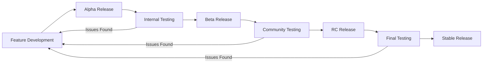

# Beta Release Guide

## Overview

This guide explains how to publish beta versions of @nexcraft/forge for testing new features before they reach production.

## What are Beta Releases?

Beta releases are pre-production versions that contain:
- 🆕 New experimental features
- 🔧 Breaking changes being tested
- 🐛 Bug fixes that need community validation
- 📊 Performance improvements under evaluation

## Publishing Beta Releases

### 🚀 Quick Start

1. **Navigate to GitHub Actions**
   - Go to your repository → Actions tab
   - Select "Beta Release" workflow
   - Click "Run workflow"

2. **Configure Release Options**
   ```
   Beta Type: beta (recommended) | alpha | rc
   Version Bump: prerelease | prepatch | preminor | premajor
   Custom Version: (optional) e.g., 1.0.0-beta.1
   ```

3. **Wait for Publication**
   - Workflow runs quality checks
   - Publishes to NPM with beta tag
   - Creates GitHub pre-release

### 📋 Release Types Explained

| Type | Purpose | When to Use | Example Version |
|------|---------|-------------|-----------------|
| **alpha** | Very early, unstable | Major new features, breaking changes | `0.6.0-alpha.1` |
| **beta** | Feature complete, needs testing | Ready for community feedback | `0.6.0-beta.1` |
| **rc** | Release candidate | Final testing before stable | `0.6.0-rc.1` |

### 🔄 Version Bump Types

| Bump Type | Description | Example |
|-----------|-------------|---------|
| **prerelease** | Increment beta number | `0.5.0-beta.1` → `0.5.0-beta.2` |
| **prepatch** | New patch with beta | `0.5.0` → `0.5.1-beta.0` |
| **preminor** | New minor with beta | `0.5.0` → `0.6.0-beta.0` |
| **premajor** | New major with beta | `0.5.0` → `1.0.0-beta.0` |

## Installing Beta Versions

### 📦 NPM Installation

```bash
# Install latest beta
npm install @nexcraft/forge@beta

# Install latest alpha
npm install @nexcraft/forge@alpha

# Install latest release candidate
npm install @nexcraft/forge@rc

# Install specific beta version
npm install @nexcraft/forge@0.6.0-beta.1
```

### 🌐 CDN Usage

```html
<!-- Latest beta via CDN -->
<script type="module" src="https://cdn.jsdelivr.net/npm/@nexcraft/forge@beta"></script>

<!-- Specific beta version -->
<script type="module" src="https://cdn.jsdelivr.net/npm/@nexcraft/forge@0.6.0-beta.1"></script>
```

### 📄 Package.json

```json
{
  "dependencies": {
    "@nexcraft/forge": "^0.6.0-beta.1"
  }
}
```

## Beta Testing Workflow

### 🔄 Development Cycle



### 👥 Who Should Use Beta Versions?

**✅ Recommended for:**
- Library maintainers
- Early adopters
- Testing environments
- Contributors and collaborators
- Users who need cutting-edge features

**❌ Not recommended for:**
- Production applications
- Mission-critical systems
- Users requiring stability
- Beginners learning the library

## Quality Assurance

### 🧪 Automatic Quality Gates

Beta releases include all production quality checks:
- ✅ ESLint validation
- ✅ TypeScript type checking
- ✅ Unit test suite (90%+ coverage)
- ✅ Build verification
- ✅ Bundle size limits

### 🐛 Reporting Issues

Found a bug in a beta release?

1. **Check GitHub Issues** for existing reports
2. **Create detailed issue** with:
   - Beta version number
   - Steps to reproduce
   - Expected vs actual behavior
   - Browser/environment info

```bash
# Include version in bug reports
npm list @nexcraft/forge
# or
node -p "require('@nexcraft/forge/package.json').version"
```

## Release Management

### 📊 Release Channels

| Channel | NPM Tag | Stability | Update Frequency |
|---------|---------|-----------|------------------|
| **Stable** | `latest` | 🟢 Production Ready | Monthly |
| **Beta** | `beta` | 🟡 Feature Complete | Weekly |
| **Alpha** | `alpha` | 🔴 Experimental | Daily |
| **RC** | `rc` | 🟢 Pre-Production | As Needed |

### 🏷️ Version Naming Convention

```
{major}.{minor}.{patch}-{channel}.{increment}

Examples:
0.5.0          (stable release)
0.5.1-beta.0   (first beta for next patch)
0.6.0-alpha.1  (first alpha for next minor)
1.0.0-rc.1     (first release candidate for v1)
```

## Migration Guide

### 🔄 Upgrading from Stable to Beta

```bash
# Check current version
npm list @nexcraft/forge

# Install beta
npm install @nexcraft/forge@beta

# Check beta features
npm run type-check  # Verify new TypeScript types
npm test           # Run your tests
```

### ↩️ Downgrading from Beta to Stable

```bash
# Revert to stable
npm install @nexcraft/forge@latest

# Clear node_modules if issues persist
rm -rf node_modules package-lock.json
npm install
```

## Best Practices

### 🎯 For Beta Testing

1. **Use in Development First**
   - Test in development environment
   - Run comprehensive tests
   - Monitor for console warnings

2. **Document Issues Thoroughly**
   - Include reproduction steps
   - Note environment details
   - Reference specific beta version

3. **Stay Updated**
   - Follow release notes
   - Subscribe to repository notifications
   - Join community discussions

### 🚀 For Publishers

1. **Clear Release Notes**
   - Highlight breaking changes
   - Explain new features
   - Include migration instructions

2. **Timely Communication**
   - Announce beta releases
   - Respond to feedback quickly
   - Plan stable release timeline

## Troubleshooting

### Common Issues

**Beta not installing:**
```bash
# Clear NPM cache
npm cache clean --force

# Try with explicit tag
npm install @nexcraft/forge@beta --force
```

**TypeScript errors with beta:**
```bash
# Update types
npm install @types/node@latest

# Check TypeScript version compatibility
npm list typescript
```

**Build failing with beta:**
```bash
# Check for breaking changes in release notes
# Update build configuration if needed
# Rollback if critical issues found
```

## Examples

### 🎮 Interactive Demo

Try beta features with our Storybook:
- **Stable**: https://forge.ignis.dev/
- **Beta**: https://beta-forge.ignis.dev/ (when available)

### 📝 Code Examples

```javascript
// Beta feature example (hypothetical)
import { ForgeDataGrid } from '@nexcraft/forge';

// New beta feature - advanced filtering
const grid = new ForgeDataGrid();
grid.filters = {
  advanced: true,  // 🆕 Beta feature
  operators: ['contains', 'startsWith', 'endsWith'] // 🆕 Beta feature
};
```

## Support

### 📞 Getting Help

- **Documentation**: Check updated docs for beta features
- **GitHub Discussions**: Community support and feedback
- **GitHub Issues**: Bug reports and feature requests
- **Discord/Slack**: Real-time community chat (if available)

### 🤝 Contributing

Help improve beta releases:
- Test new features
- Report bugs
- Suggest improvements
- Submit pull requests
- Write documentation

---

**Remember**: Beta versions are stepping stones to stable releases. Your testing and feedback help make @nexcraft/forge better for everyone! 🚀