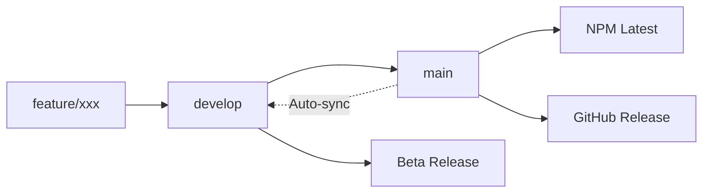

# Release Process Guide

## Overview

This guide provides a complete walkthrough of the @nexcraft/forge release process, including automated workflows, manual interventions, and troubleshooting procedures.

## Release Types

### 🎯 Production Releases (Stable)

**Automatic Release Process:**
1. Merge PR to `main` branch
2. CI workflow validates code quality
3. Release workflow automatically triggers
4. Version bumped based on conventional commits
5. Package published to NPM with `latest` tag
6. GitHub release created with changelog
7. Documentation updated and deployed

**Manual Release Process:**
1. Go to GitHub Actions → "Release & Publish"
2. Click "Run workflow" on `main` branch
3. Select release type: `patch`, `minor`, `major`, or `prerelease`
4. Workflow publishes automatically

### 🧪 Beta/Alpha/RC Releases

**Beta Release Process:**
1. Go to GitHub Actions → "Beta Release"
2. Click "Run workflow" (can run from any branch)
3. Configure options:
   - **Beta Type**: `beta`, `alpha`, `rc`
   - **Version Bump**: `prerelease`, `prepatch`, `preminor`, `premajor`
   - **Custom Version**: Optional override
4. Workflow publishes with appropriate NPM tag

## Branch Strategy

### 🌳 Git Workflow



**Branch Purposes:**
- **`main`**: Production-ready code, triggers stable releases
- **`develop`**: Integration branch, synced automatically with main
- **`feature/*`**: Feature development, merged to develop

**Auto-Sync Process:**
- Every push to `main` triggers sync workflow
- `develop` branch automatically updated with main changes
- Version numbers synchronized between branches

## Workflow Details

### 🔄 CI Workflow (`ci.yml`)

**Triggers:**
- Push to `develop` branch
- Pull requests to `main`

**Quality Gates:**
- ESLint validation (zero errors)
- TypeScript type checking (zero errors)
- Unit tests (90%+ coverage required)
- Integration tests
- Build verification
- Storybook build

### 🚀 Release Workflow (`release.yml`)

**Triggers:**
- Manual dispatch (immediate)
- Automatic after CI success on main

**Process:**
1. **Quality Verification**: Re-runs lint, type-check, tests, build
2. **Version Determination**: Based on conventional commits or manual input
3. **Package Building**: Creates optimized production build
4. **Version Bumping**: Updates package.json and locks
5. **Changelog Generation**: Creates meaningful release notes
6. **Git Operations**: Commits changes, creates tags, pushes
7. **NPM Publishing**: Publishes with `latest` tag
8. **GitHub Release**: Creates release with artifacts
9. **Documentation**: Deploys updated Storybook

### 🧪 Beta Release Workflow (`beta-release.yml`)

**Triggers:**
- Manual dispatch only

**Process:**
1. **Quality Gates**: Full CI validation
2. **Beta Version**: Creates version like `0.6.0-beta.1`
3. **NPM Publishing**: Publishes with beta tag (`@beta`, `@alpha`, `@rc`)
4. **GitHub Pre-release**: Creates pre-release with warnings
5. **Beta Documentation**: Provides installation instructions

### 🔄 Sync Workflow (`sync-branches.yml`)

**Triggers:**
- Push to `main` branch

**Process:**
1. **Basic Quality**: Lint, type-check, build on main
2. **Version Sync**: Updates develop package.json to match main
3. **Branch Merge**: Merges main changes into develop
4. **Conflict Resolution**: Handles merge conflicts gracefully

## Version Management

### 📊 Semantic Versioning

Following [SemVer](https://semver.org/) with conventional commits:

| Commit Type | Version Impact | Example |
|-------------|---------------|---------|
| `fix:` | Patch (0.0.1) | Bug fixes |
| `feat:` | Minor (0.1.0) | New features |
| `BREAKING CHANGE:` or `!` | Major (1.0.0) | Breaking changes |
| `chore:`, `docs:` | No bump | Maintenance |

### 🏷️ NPM Tags

| Tag | Purpose | Installation | Stability |
|-----|---------|--------------|-----------|
| `latest` | Production releases | `npm install @nexcraft/forge` | 🟢 Stable |
| `beta` | Feature testing | `npm install @nexcraft/forge@beta` | 🟡 Testing |
| `alpha` | Experimental | `npm install @nexcraft/forge@alpha` | 🔴 Experimental |
| `rc` | Release candidates | `npm install @nexcraft/forge@rc` | 🟢 Near-stable |

## Quality Assurance

### 🛡️ Pre-Release Checks

**Automated Quality Gates:**
- ✅ ESLint: Zero errors, warnings acceptable
- ✅ TypeScript: Zero type errors
- ✅ Tests: 90%+ coverage, all tests passing
- ✅ Build: Successful production build
- ✅ Bundle Size: Under reasonable limits (current ~31KB)
- ✅ Dependencies: No high/critical vulnerabilities

**Manual Verification (Recommended):**
- 🔍 Visual regression testing
- 🧪 Cross-browser compatibility
- 📱 Mobile responsiveness
- ♿ Accessibility compliance
- 🔗 Link and reference validation

### 📋 Release Checklist

**Before Major Release:**
- [ ] Update documentation
- [ ] Review breaking changes
- [ ] Test upgrade paths
- [ ] Notify community
- [ ] Prepare migration guide

**Before Any Release:**
- [ ] All CI checks passing
- [ ] No open critical issues
- [ ] Dependencies up to date
- [ ] Changelog meaningful
- [ ] Version number appropriate

## Troubleshooting

### 🚨 Common Issues

**Release Workflow Fails:**
```bash
# Check workflow logs in GitHub Actions
# Common causes:
# 1. NPM token expired or invalid
# 2. Version already exists
# 3. Build failures
# 4. Permission issues
```

**Branch Sync Fails:**
```bash
# Usually merge conflicts
# Resolution:
# 1. Manual merge required
# 2. Fix conflicts in develop
# 3. Push updated develop branch
```

**NPM Publish Fails:**
```bash
# Check token permissions
npm whoami

# Verify package doesn't exist
npm view @nexcraft/forge@<version>

# Test with dry run
npm publish --dry-run
```

### 🔧 Emergency Procedures

**Hotfix Release:**
```bash
# 1. Create hotfix branch from main
git checkout main
git checkout -b hotfix/critical-fix

# 2. Make minimal fix
git commit -m "fix: critical security issue"

# 3. Merge to main (triggers release)
git checkout main
git merge hotfix/critical-fix
git push origin main
```

**Rollback Release:**
```bash
# 1. Deprecate broken version
npm deprecate @nexcraft/forge@<bad-version> "Critical issue, use previous version"

# 2. Promote previous version to latest
npm dist-tag add @nexcraft/forge@<good-version> latest

# 3. Revert in git if needed
git revert <commit-hash>
git push origin main
```

## Release Communication

### 📢 Announcement Strategy

**Major Releases (1.0.0, 2.0.0):**
- GitHub release with detailed notes
- Blog post or documentation update
- Community notifications
- Social media announcement

**Minor Releases (0.1.0, 0.2.0):**
- GitHub release with changelog
- Update documentation
- Notify active contributors

**Patch Releases (0.0.1, 0.0.2):**
- GitHub release (automatic)
- Brief changelog update

**Beta/Alpha Releases:**
- GitHub pre-release
- Clear "beta" warnings
- Testing instructions

### 📝 Changelog Standards

**Good Changelog Entry:**
```markdown
## v0.6.0 - 2025-09-06

### 🚀 New Features
- **DataTable**: Added advanced filtering with 20+ operators
- **FormField**: Enhanced validation with custom rules
- **Button**: New loading state with spinner animation

### 🐛 Bug Fixes
- Fixed memory leak in Modal component cleanup
- Resolved accessibility issues in DatePicker

### ⚠️ Breaking Changes
- `Button` component: `type` prop renamed to `variant`
- Migration: Replace `type="primary"` with `variant="primary"`

### 🔧 Internal
- Improved TypeScript types for better IntelliSense
- Upgraded to Lit 3.2.0 for better performance
```

## Monitoring & Metrics

### 📊 Release Metrics

**Track these metrics:**
- Build success rate
- Time from merge to release
- NPM download trends
- GitHub stars/forks growth
- Issue resolution time
- Community contributions

**Tools:**
- GitHub Actions dashboard
- NPM package statistics
- Bundle analyzer reports
- Dependency security scans

### 🎯 Success Criteria

**Healthy Release Process:**
- 🟢 >95% automated release success rate
- 🟢 <10 minutes from merge to NPM
- 🟢 Zero critical security vulnerabilities
- 🟢 Consistent release cadence
- 🟢 Active community engagement

## Advanced Features

### 🎮 Feature Flags

For gradual rollouts:
```javascript
// Component with feature flag
export class ForgeComponent extends BaseElement {
  static features = {
    newFeature: process.env.NODE_ENV !== 'production'
  };
}
```

### 📦 Bundle Analysis

Monitor bundle size:
```bash
# Analyze bundle in CI
npm run bundle-analyze

# Size limits in package.json
"bundleSize": [
  {
    "path": "./dist/nexcraft-forge.es.js",
    "maxSize": "50KB"
  }
]
```

### 🔄 Canary Releases

For high-risk changes:
```bash
# Publish canary version
npm version prerelease --preid=canary
npm publish --tag=canary

# Install canary
npm install @nexcraft/forge@canary
```

## Future Enhancements

### 📋 Planned Improvements

- [ ] Automated visual regression testing
- [ ] Performance benchmarking in CI
- [ ] Multi-environment deployment
- [ ] Advanced rollback strategies
- [ ] Integration with design systems
- [ ] Automated dependency updates

---

**Need Help?** Check our [troubleshooting guide](../troubleshooting.md) or open a [GitHub Discussion](https://github.com/dev-ignis/forge/discussions). 🚀