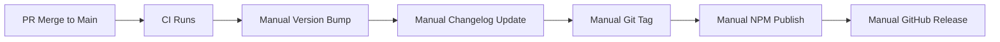
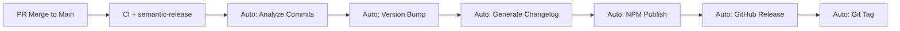

# Semantic Release Migration Plan
**Status**: Planning  
**Priority**: High  
**Timeline**: 1-2 days  
**Impact**: Process Improvement  

## 📋 Executive Summary

Migrate from manual release process to automated semantic-release to eliminate versioning errors, standardize changelogs, and streamline the release pipeline. This addresses recent issues like manual changelog errors (v0.5.2-dev) and version drift between local/NPM registry.

**Current Problems**:
- Manual version bumping prone to human error
- Inconsistent changelog formatting and mistakes
- Version synchronization issues between local package.json and NPM
- Complex multi-step release workflows requiring manual intervention

**Solution**: Implement semantic-release for fully automated releases based on conventional commits.

## 🎯 Migration Objectives

### **Primary Goals**
1. **Eliminate Manual Errors**: Automate version bumping and changelog generation
2. **Standardize Process**: Enforce conventional commits and consistent formatting  
3. **Streamline Workflow**: Single merge to main triggers complete release
4. **Improve Documentation**: Auto-generated changelogs with commit links and issue references

### **Success Metrics**
- [ ] Zero manual version conflicts
- [ ] 100% accurate changelog generation
- [ ] Sub-5 minute release pipeline
- [ ] Conventional commit adoption >90%

## 🔄 Current State Analysis

### **Existing Release Process**


**Pain Points**:
- 6 manual steps with potential for error at each stage
- Inconsistent changelog formatting (recent v0.5.2-dev error)
- Version drift (local: 0.5.1-beta.0, NPM: 0.5.2-beta.0)
- Complex workflow files requiring maintenance

### **Target State with semantic-release**


**Benefits**:
- Single automated pipeline
- Consistent, professional changelogs
- Zero version synchronization issues
- Reduced maintenance overhead

## 🛠️ Implementation Plan

### **Phase 1: Setup & Configuration (Day 1)**

#### **Step 1.1: Install Dependencies**
```bash
npm install --save-dev \
  semantic-release@^22.0.0 \
  @semantic-release/changelog@^6.0.0 \
  @semantic-release/git@^10.0.0 \
  @semantic-release/exec@^6.0.0
```

#### **Step 1.2: Configure semantic-release**
```json
// package.json additions
{
  "scripts": {
    "semantic-release": "semantic-release"
  },
  "release": {
    "branches": [
      "+([0-9])?(.{+([0-9]),x}).x",
      "main",
      {
        "name": "develop",
        "prerelease": "beta"
      }
    ],
    "plugins": [
      "@semantic-release/commit-analyzer",
      "@semantic-release/release-notes-generator",
      [
        "@semantic-release/changelog",
        {
          "changelogFile": "CHANGELOG.md"
        }
      ],
      "@semantic-release/npm",
      [
        "@semantic-release/git",
        {
          "assets": ["CHANGELOG.md", "package.json", "package-lock.json"],
          "message": "chore(release): ${nextRelease.version} [skip ci]\n\n${nextRelease.notes}"
        }
      ],
      "@semantic-release/github"
    ]
  }
}
```

#### **Step 1.3: Create Release Configuration**
```javascript
// .releaserc.js
module.exports = {
  branches: [
    '+([0-9])?(.{+([0-9]),x}).x',
    'main',
    {
      name: 'develop',
      prerelease: 'beta'
    }
  ],
  plugins: [
    [
      '@semantic-release/commit-analyzer',
      {
        preset: 'conventionalcommits',
        releaseRules: [
          { type: 'feat', release: 'minor' },
          { type: 'fix', release: 'patch' },
          { type: 'perf', release: 'patch' },
          { type: 'revert', release: 'patch' },
          { type: 'docs', release: false },
          { type: 'style', release: false },
          { type: 'refactor', release: 'patch' },
          { type: 'test', release: false },
          { type: 'chore', release: false },
          { scope: 'no-release', release: false }
        ]
      }
    ],
    [
      '@semantic-release/release-notes-generator',
      {
        preset: 'conventionalcommits',
        presetConfig: {
          types: [
            { type: 'feat', section: '🚀 Features' },
            { type: 'fix', section: '🐛 Bug Fixes' },
            { type: 'perf', section: '⚡ Performance' },
            { type: 'revert', section: '🔄 Reverts' },
            { type: 'docs', section: '📚 Documentation', hidden: true },
            { type: 'style', section: '🎨 Styles', hidden: true },
            { type: 'refactor', section: '♻️  Refactor' },
            { type: 'test', section: '✅ Tests', hidden: true },
            { type: 'chore', section: '🔧 Chores', hidden: true }
          ]
        }
      }
    ],
    [
      '@semantic-release/changelog',
      {
        changelogFile: 'CHANGELOG.md',
        changelogTitle: '# Forge UI Library Changelog\n\nAll notable changes to @nexcraft/forge will be documented in this file.\n\nThe format is based on [Keep a Changelog](https://keepachangelog.com/en/1.0.0/),\nand this project adheres to [Semantic Versioning](https://semver.org/spec/v2.0.0.html).'
      }
    ],
    '@semantic-release/npm',
    [
      '@semantic-release/git',
      {
        assets: ['CHANGELOG.md', 'package.json', 'package-lock.json'],
        message: 'chore(release): v${nextRelease.version} [skip ci]\n\n${nextRelease.notes}'
      }
    ],
    [
      '@semantic-release/github',
      {
        successComment: false,
        failComment: false,
        releasedLabels: false
      }
    ]
  ]
};
```

### **Phase 2: Workflow Migration (Day 1)**

#### **Step 2.1: Update Release Workflow**
```yaml
# .github/workflows/release.yml
name: Release & Publish

on:
  push:
    branches: [main, develop]
  workflow_dispatch:

permissions:
  contents: write
  packages: write
  id-token: write
  issues: write
  pull-requests: write

jobs:
  release:
    name: Semantic Release
    runs-on: ubuntu-latest
    
    steps:
      - name: Checkout
        uses: actions/checkout@v4
        with:
          fetch-depth: 0
          token: ${{ secrets.GITHUB_TOKEN }}
      
      - name: Setup Node.js
        uses: actions/setup-node@v4
        with:
          node-version: '20.x'
          registry-url: 'https://registry.npmjs.org'
      
      - name: Cache node_modules
        uses: actions/cache@v4
        id: npm-cache
        with:
          path: node_modules
          key: ${{ runner.os }}-node-20.x-${{ hashFiles('**/package-lock.json') }}
          restore-keys: |
            ${{ runner.os }}-node-20.x-
      
      - name: Install dependencies
        if: steps.npm-cache.outputs.cache-hit != 'true'
        run: npm ci
      
      - name: Lint
        run: npm run lint
      
      - name: Type Check
        run: npm run type-check
      
      - name: Test
        run: npm run test:coverage
      
      - name: Build
        run: npm run build
      
      - name: Semantic Release
        run: npx semantic-release
        env:
          GITHUB_TOKEN: ${{ secrets.GITHUB_TOKEN }}
          NPM_TOKEN: ${{ secrets.NPM_TOKEN }}
          GIT_AUTHOR_NAME: github-actions[bot]
          GIT_AUTHOR_EMAIL: github-actions[bot]@users.noreply.github.com
          GIT_COMMITTER_NAME: github-actions[bot]
          GIT_COMMITTER_EMAIL: github-actions[bot]@users.noreply.github.com
```

#### **Step 2.2: Remove Legacy Workflows**
- [ ] Archive `beta-release.yml` (replaced by develop branch releases)
- [ ] Simplify CI workflow (remove manual version logic)
- [ ] Update sync workflow for semantic-release compatibility

### **Phase 3: Conventional Commits Setup (Day 1)**

#### **Step 3.1: Commit Message Template**
```bash
# .gitmessage
# <type>[optional scope]: <description>
#
# [optional body]
#
# [optional footer(s)]
#
# --- COMMIT TYPES ---
# feat:     A new feature (minor version bump)
# fix:      A bug fix (patch version bump)
# docs:     Documentation only changes (no version bump)
# style:    Code style changes (formatting, missing semicolons, etc)
# refactor: Code changes that neither fix bugs nor add features
# perf:     Performance improvements (patch version bump)
# test:     Adding or updating tests (no version bump)
# chore:    Changes to build process, auxiliary tools, libraries (no version bump)
#
# --- BREAKING CHANGES ---
# Add ! after type (e.g., "feat!:") or "BREAKING CHANGE:" in footer for major version bump
#
# --- EXAMPLES ---
# feat(auth): add OAuth 2.0 support
# fix(button): resolve accessibility issue with focus
# feat!: remove deprecated color prop from button
# BREAKING CHANGE: color prop has been removed, use variant instead
```

#### **Step 3.2: Git Configuration**
```bash
# Set up git message template
git config commit.template .gitmessage

# Optional: Install commitizen for interactive commits
npm install --save-dev commitizen cz-conventional-changelog
echo '{ "path": "cz-conventional-changelog" }' > .czrc
```

#### **Step 3.3: Commit Linting (Optional)**
```json
// package.json
{
  "devDependencies": {
    "@commitlint/cli": "^18.0.0",
    "@commitlint/config-conventional": "^18.0.0",
    "husky": "^8.0.0"
  },
  "commitlint": {
    "extends": ["@commitlint/config-conventional"]
  }
}
```

### **Phase 4: Migration & Testing (Day 2)**

#### **Step 4.1: Backup Current State**
```bash
# Create backup branch with current manual changelog
git checkout -b backup/pre-semantic-release
git push origin backup/pre-semantic-release

# Tag current state
git tag manual-release-backup
git push origin manual-release-backup
```

#### **Step 4.2: Convert Existing Changelog**
- [ ] Analyze current changelog format
- [ ] Preserve historical entries (pre-semantic-release)
- [ ] Add migration note in changelog header

```markdown
# Forge UI Library Changelog

> **Note**: Starting from v0.5.2, this changelog is automatically generated by [semantic-release](https://github.com/semantic-release/semantic-release).  
> Historical entries (v0.5.1 and below) were manually maintained.

## [Unreleased]

<!-- semantic-release will populate releases below this line -->

## Legacy Releases (Manual)
### [v0.5.1] - 2025-09-06
...existing content...
```

#### **Step 4.3: Test Migration**
```bash
# Test semantic-release in dry-run mode
npx semantic-release --dry-run --no-ci

# Test with different commit types
git commit -m "feat: add semantic-release migration"
npx semantic-release --dry-run --no-ci

git commit -m "fix: resolve version synchronization issues"
npx semantic-release --dry-run --no-ci

git commit -m "feat!: migrate to semantic-release workflow"
npx semantic-release --dry-run --no-ci
```

## 🔍 Quality Assurance

### **Pre-Migration Checklist**
- [ ] Backup current release workflows
- [ ] Document current version state (local vs NPM)
- [ ] Test semantic-release configuration in dry-run mode
- [ ] Validate conventional commit examples
- [ ] Review branch protection rules compatibility

### **Post-Migration Validation**
- [ ] First automated release completes successfully
- [ ] Changelog format matches expectations
- [ ] NPM package publishes with correct version
- [ ] GitHub release created with proper notes
- [ ] No version drift between local and NPM

### **Rollback Plan**
If migration fails:
1. Revert to backup branch `backup/pre-semantic-release`
2. Restore legacy workflow files
3. Manual hotfix release if needed
4. Document lessons learned for future migration

## 📊 Expected Outcomes

### **Before Migration**
```
Current Process Issues:
❌ Manual changelog errors (v0.5.2-dev)
❌ Version drift (local: 0.5.1-beta.0, NPM: 0.5.2-beta.0)
❌ 6-step manual release process
❌ Inconsistent formatting
❌ Human error in version bumping
```

### **After Migration**
```
Automated Process Benefits:
✅ Zero manual changelog errors
✅ Perfect version synchronization
✅ Single-step release process
✅ Consistent, professional formatting
✅ Conventional commit standards enforced
✅ Auto-generated GitHub releases
```

## 🎯 Conventional Commit Standards

### **Commit Types and Versioning**
| Type | Description | Version Impact | Example |
|------|-------------|----------------|---------|
| `feat` | New feature | Minor (0.5.0 → 0.6.0) | `feat(progress): add circular progress component` |
| `fix` | Bug fix | Patch (0.5.0 → 0.5.1) | `fix(button): resolve focus management issue` |
| `perf` | Performance | Patch (0.5.0 → 0.5.1) | `perf(modal): optimize backdrop rendering` |
| `refactor` | Code restructure | Patch (0.5.0 → 0.5.1) | `refactor(core): improve BaseElement structure` |
| `docs` | Documentation | No release | `docs(readme): update installation guide` |
| `test` | Tests | No release | `test(button): add accessibility tests` |
| `chore` | Maintenance | No release | `chore(deps): update lit to v3.1.0` |
| `feat!` | Breaking feature | Major (0.5.0 → 1.0.0) | `feat!: remove deprecated color prop` |
| `fix!` | Breaking fix | Major (0.5.0 → 1.0.0) | `fix!: change modal API structure` |

### **Scopes for Forge Project**
```
Component Scopes:
- atoms: atoms/button, atoms/input, etc.
- molecules: molecules/modal, molecules/form-field, etc.
- organisms: organisms/data-table, organisms/tabs, etc.

System Scopes:
- core: BaseElement, utilities
- types: TypeScript definitions
- build: Build system, bundling
- ci: CI/CD, workflows
- docs: Documentation, Storybook
- test: Testing infrastructure
```

### **Example Commit Messages**
```bash
# New component (minor version)
feat(atoms): add progress component with linear and circular variants

# Bug fix (patch version)
fix(modal): prevent scroll when modal is open

# Performance improvement (patch version)
perf(data-table): optimize virtual scrolling for large datasets

# Breaking change (major version)
feat(button)!: remove deprecated color prop

BREAKING CHANGE: The color prop has been removed from forge-button. 
Use the variant prop instead:
- color="primary" → variant="primary"  
- color="secondary" → variant="secondary"

# Documentation (no release)
docs(integration): add Vue 3 composition API examples

# Chore (no release)
chore(deps): update @lit/context to v1.1.0
```

## 📋 Migration Timeline

### **Day 1: Setup & Configuration**
- **Morning (2-3 hours)**:
  - Install semantic-release dependencies
  - Create configuration files (.releaserc.js)
  - Update package.json scripts and release config
  
- **Afternoon (2-3 hours)**:
  - Update GitHub workflow files
  - Create commit message templates
  - Test dry-run configurations

### **Day 2: Migration & Validation**
- **Morning (1-2 hours)**:
  - Backup current state
  - Convert existing changelog format
  - Create migration documentation
  
- **Afternoon (1-2 hours)**:
  - Deploy to develop branch for testing
  - Validate first semantic release
  - Monitor and adjust configuration

## ✅ Definition of Done

### **Migration Complete When:**
- [ ] semantic-release successfully runs on both main and develop branches
- [ ] Automated changelog generation produces professional output
- [ ] NPM publishing works without manual intervention
- [ ] GitHub releases are created with proper formatting
- [ ] Version synchronization between local package.json and NPM is perfect
- [ ] Team can use conventional commits effectively
- [ ] Legacy workflow files are archived/removed
- [ ] Documentation is updated with new process

### **Success Validation:**
- [ ] First semantic release (feat commit) creates minor version bump
- [ ] First semantic fix (fix commit) creates patch version bump
- [ ] Breaking change (feat! commit) would create major version bump
- [ ] No-release commits (docs, chore) don't trigger releases
- [ ] Beta releases work correctly on develop branch

## 🔄 Post-Migration Maintenance

### **Ongoing Tasks**
- [ ] Monitor semantic-release performance and adjust configuration
- [ ] Train team on conventional commit standards
- [ ] Update contribution guidelines with new commit format
- [ ] Create commit message linting for pull requests
- [ ] Periodic review of release notes quality

### **Quarterly Reviews**
- [ ] Analyze commit message quality and team adoption
- [ ] Review changelog readability and usefulness  
- [ ] Optimize semantic-release configuration based on usage
- [ ] Update conventional commit scopes as project grows

---

**Next Steps**: Upon approval, begin Phase 1 implementation with semantic-release dependency installation and configuration setup.